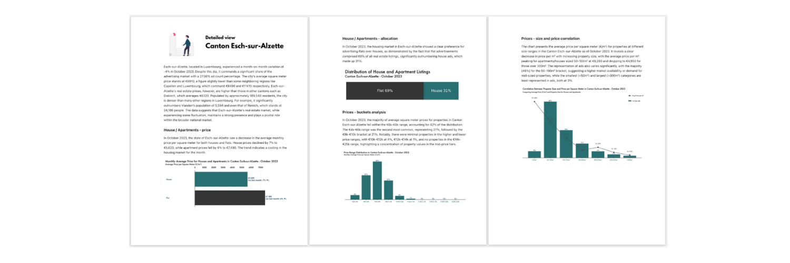

## 
 December 2023

 

#### <i> <strong> Disclaimer </strong> </i>

<i> This analysis provides an overview of the asking prices by homeowners in Luxembourg's real estate market and should <strong>not be interpreted as the final transaction prices</strong>, which may differ. <strong>The information is intended for informational purposes only and does not represent official market data or statistics</strong>. The presented data is based on personal observations and publicly available sources, without any guarantee of reliability or quality. Market fluctuations and changes may occur, and this analysis might not reflect the most current conditions. No responsibility is assumed for decisions or actions taken based on this information. Users should conduct their own due diligence or seek professional advice for comprehensive market insights. </i>

 

#### <strong> Introduction </strong>

This research presents a manually curated analysis of Luxembourg's housing market, derived from closely look at nearly 400 real estate agencies accross the country. Each day, new listings were personally observed, focusing three details: price, size, and location. This hands-on method ensured a thorough and accurate collection of data, allowing for an in-depth view of the market trends. The project's unique approach of individually tracking each advertisement offers a distinctive and detailed perspective on the housing landscape in Luxembourg.

 

#### <strong> About cantons </strong>

As of 2023, Luxembourg comprises 12 cantons, each playing a significant role in the country's administrative and electoral framework. Luxembourg Canton leads with a notable population of 204,358, followed closely by Esch-sur-Alzette at 189,540. In contrast, Vianden, with a population of 5,594, represents one of the smaller cantons. Other cantons like Capellen (52,828), Diekirch (35,150), and Mersch (35,579) contribute to the country's demographic mosaic.

#### <strong> Monthly prices </strong>

    

        <table>
        <tr>
            <td>
                
            </td>
            <td>
            
            </td>
        </tr>
        </table>
     

The chart displays the average square meter prices by canton in Luxembourg for December 2023. Luxembourg canton leads with the highest average price at €11,360 per square meter. Cantons Capellen and Grevenmacher follow with considerable lower averages at €8,400 and €7,640 respectively. On the lower end of the spectrum, Wiltz and Vianden present the most affordable prices at €4,840 and €4,110 respectively. Prices exhibit significant regional variation, indicating a diverse real estate market across the country.

 

 

#### <strong> Monthly ads distribution </strong>

 

In December 2023, real estate advertising in Luxembourg was predominantly concentrated in the Luxembourg canton with 36% of the total ads, followed by Esch-sur-Alzette at 23%, and Capellen at 15%. The remaining cantons—Mersch, Grevenmacher, Remich, Diekirch, Redange, Wiltz, Echternach, and Clervaux—collectively accounted for 26% of the ads, with individual contributions ranging from 1% to 7%. This distribution highlights a significant skew towards the central regions with Luxembourg and Esch-sur-Alzette accounting for the majority of real estate activity.

 

#### <strong> Correlation with distance from the capital </strong>

The chart indicates a negative correlation between the average square meter price of properties and their distance from the city center in December 2023. Luxembourg city displays the highest property prices along with the shortest distance to the city center, which implies a premium on proximity to the central hub. As the distance from the city center increases, the average price per square meter generally decreases, with cities like Clervaux, Wiltz, and Vianden showing significantly lower prices at greater distances.

 

### Interested in the Detailed Analysis for 12 Cantons?

You can buy a full ~40 pages report for each canton where I am summarizing monthly prices, ads distribution, price correlations, and unique market dynamics. Discover invaluable information and trends in a format that’s both insightful and easy to understand, providing a clear overview of the real estate landscape for informed planning and analysis.

[🔒 Buy Full PDF Report](https://ivankmk.gumroad.com/l/uiigk)

