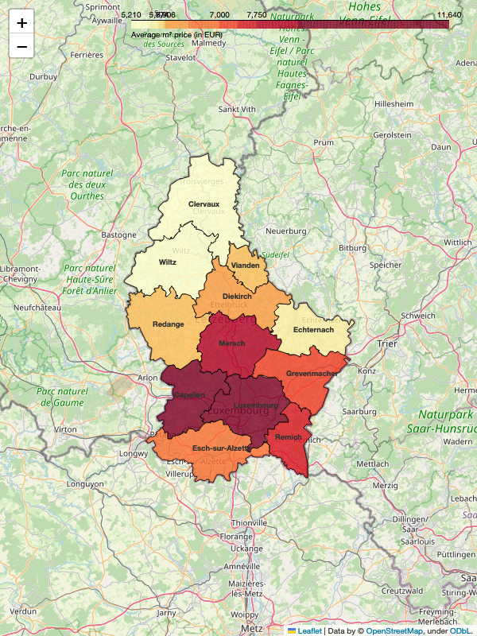

<center><div>

</div></center>

## <center> November 2023</center>

<br>

#### <i> <strong> Disclaimer </strong> </i>

<i> This analysis provides an overview of the asking prices by homeowners in Luxembourg's real estate market and should not be interpreted as the final transaction prices, which may differ. The information is intended for informational purposes only and does not represent official market data or statistics. The presented data is based on personal observations and publicly available sources, without any guarantee of reliability or quality. Market fluctuations and changes may occur, and this analysis might not reflect the most current conditions. No responsibility is assumed for decisions or actions taken based on this information. Users should conduct their own due diligence or seek professional advice for comprehensive market insights. </i>

<br>

#### <strong> Introduction </strong>

This research presents a manually curated analysis of Luxembourg's housing market, derived from closely look at nearly 400 real estate agencies accross the country. Each day, new listings were personally observed, focusing three details: price, size, and location. This hands-on method ensured a thorough and accurate collection of data, allowing for an in-depth view of the market trends. The project's unique approach of individually tracking each advertisement offers a distinctive and detailed perspective on the housing landscape in Luxembourg.

<br>

#### <strong> About cantons </strong>

As of 2023, Luxembourg comprises 12 cantons, each playing a significant role in the country's administrative and electoral framework. Luxembourg Canton leads with a notable population of 204,358, followed closely by Esch-sur-Alzette at 189,540. In contrast, Vianden, with a population of 5,594, represents one of the smaller cantons. Other cantons like Capellen (52,828), Diekirch (35,150), and Mersch (35,579) contribute to the country's demographic mosaic.

#### <strong> Monthly prices </strong>

<center>
    <div>
        <table>
        <tr>
            <td>
                
            </td>
            <td>
            
            </td>
        </tr>
        </table>
     </div>
</center>

In November 2023, the average square meter price for real estate across different cantons in Luxembourg showed significant regional variance. Luxembourg Canton led with the highest average price at €11,640 per square meter, while Wiltz Canton offered the most affordable average at €5,210 per square meter. Other notable figures include Capellen and Mersch in the mid-range, with averages of €8,690 and €7,820 respectively. The chart illustrates a clear price gradient, descending from the most expensive canton in the capital region to more economical prices in the northern regions.

<br>

<br>

#### <strong> Monthly ads distribution </strong>

<center><div>

</div></center>

<br>

In November 2023, the Luxembourg canton had the highest share of real estate ads at 36%, followed by Esch-sur-Alzette with 25%. Capellen came in third with 13% of the ads, indicating a clear concentration of real estate activity in these regions. Other cantons such as Diekirch (5%), Mersch (6%), and Remich (3%) had moderate representation, while the remaining cantons, including Grevenmacher, Redange, Clervaux, Wiltz, Echternach, and Vianden had relatively low ad distributions, ranging from 1% to 3%. This points to a potential focus of housing market activity within Luxembourg's central and southern cantons.

<br>

#### <strong> Correlation with distance from the capital </strong>

<center><div>

</div></center>

The chart illustrates a negative correlation between the average price per square meter for properties and their distance from the city center (Gare Centrale) in November 2023. Luxembourg city has the highest property prices and is closest to the center, with prices declining as the distance increases. Locations like Diekirch, Vianden, and Wiltz offer much lower prices but are situated considerably farther from Gare Centrale. The data suggests that proximity to the city center significantly influences property values across various regions.

<br>

### Interested in the Detailed Analysis for 12 Cantons?

You can buy a full ~40 pages report for each canton where I am summarizing monthly prices, ads distribution, price correlations, and unique market dynamics. Discover invaluable information and trends in a format that’s both insightful and easy to understand, providing a clear overview of the real estate landscape for informed planning and analysis.

[🔒 Buy Full PDF Report](#)

<center><div>

</div></center>


```python

```
