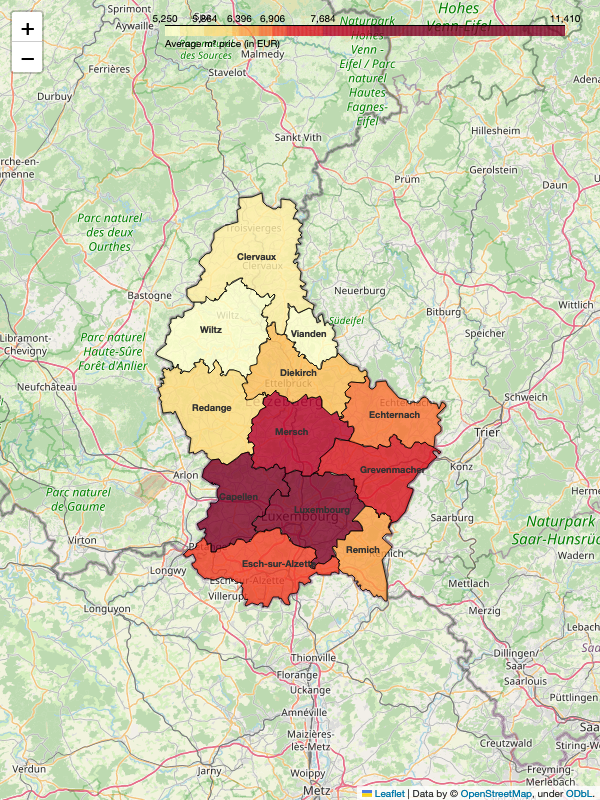

## 
 October 2023

 

#### <i> <strong> Disclaimer </strong> </i>

<i> This analysis provides an overview of the asking prices by homeowners in Luxembourg's real estate market and should <strong>not be interpreted as the final transaction prices</strong>, which may differ. <strong>The information is intended for informational purposes only and does not represent official market data or statistics</strong>. The presented data is based on personal observations and publicly available sources, without any guarantee of reliability or quality. Market fluctuations and changes may occur, and this analysis might not reflect the most current conditions. No responsibility is assumed for decisions or actions taken based on this information. Users should conduct their own due diligence or seek professional advice for comprehensive market insights. </i>

 

#### <strong> Introduction </strong>

This research presents a manually curated analysis of Luxembourg's housing market, derived from closely look at nearly 400 real estate agencies accross the country. Each day, new listings were personally observed, focusing three details: price, size, and location. This hands-on method ensured a thorough and accurate collection of data, allowing for an in-depth view of the market trends. The project's unique approach of individually tracking each advertisement offers a distinctive and detailed perspective on the housing landscape in Luxembourg.

 

#### <strong> About cantons </strong>

As of 2023, Luxembourg comprises 12 cantons, each playing a significant role in the country's administrative and electoral framework. Luxembourg Canton leads with a notable population of 204,358, followed closely by Esch-sur-Alzette at 189,540. In contrast, Vianden, with a population of 5,594, represents one of the smaller cantons. Other cantons like Capellen (52,828), Diekirch (35,150), and Mersch (35,579) contribute to the country's demographic mosaic.

#### <strong> Monthly prices </strong>

    

        <table>
        <tr>
            <td>
                
            </td>
            <td>
            
            </td>
        </tr>
        </table>
     

The chart displays the average square meter price for real estate in various cantons of Luxembourg for October 2023. Luxembourg canton has the highest price at €11,410 per square meter, indicating a strong demand or premium valuation in this region. In contrast, Wiltz canton exhibits the lowest average price at €5,250, which is less than half of Luxembourg's average. There appears to be a significant spatial price variation across the cantons, which could have implications for market dynamics within the country.

 

 

#### <strong> Monthly ads distribution </strong>

 

This chart displays the distribution of advertisements across different cantons in October 2023, with Luxembourg receiving the largest share at 32%, followed by Esch-sur-Alzette at 28%, and Capellen at 14%. Other cantons, such as Mersch, Diekirch, Grevenmacher, and the rest, have significantly smaller shares, ranging from 1% to 6%. The data suggests that ad distribution is heavily concentrated in the Luxembourg and Esch-sur-Alzette cantons.

 

#### <strong> Correlation with distance from the capital </strong>

The chart presents a clear negative correlation between the average square meter price of property and its distance from the city center in Luxembourg for October 2023. Properties closest to the city center, particularly in Luxembourg itself, command the highest prices, while those in more distant areas like Clervaux show a significant decrease in price. This suggests that proximity to the city center drives real estate values, and as distance increases, average prices decline correspondingly.

 

### Interested in the Detailed Analysis for 12 Cantons?

You can buy a full report for each canton where I am summarizing monthly prices, ads distribution, price correlations, and unique market dynamics. Discover invaluable information and trends in a format that’s both insightful and easy to understand, providing a clear overview of the real estate landscape for informed planning and analysis.

[🔒 Buy Full 39 pages PDF Report](https://ivankmk.gumroad.com/l/kowwv)

