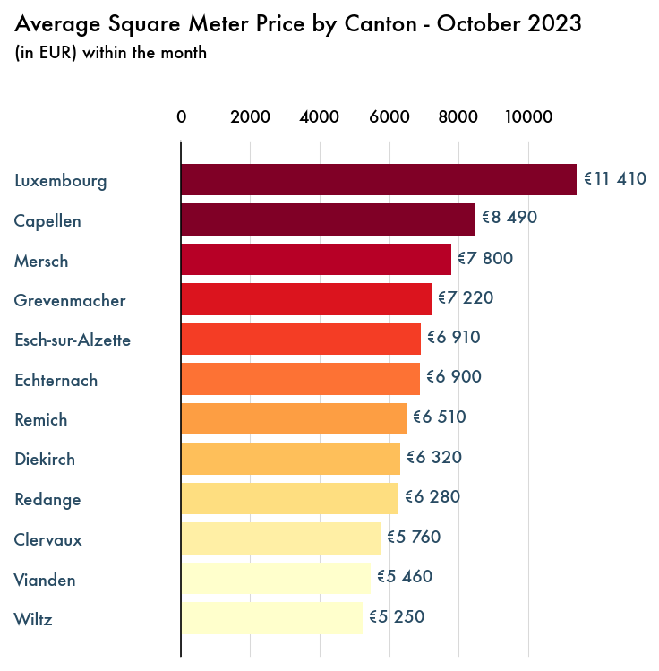

# <center> Luxembourg Housing Market Analysis</center>

## <center> October 2023</center>

#### Disclaimer

This analysis provides an overview of the asking prices by homeowners in Luxembourg's real estate market and should not be interpreted as the final transaction prices, which may differ. The information is intended for informational purposes only and does not represent official market data or statistics. The presented data is based on personal observations and publicly available sources, without any guarantee of reliability or quality. Market fluctuations and changes may occur, and this analysis might not reflect the most current conditions. No responsibility is assumed for decisions or actions taken based on this information. Users should conduct their own due diligence or seek professional advice for comprehensive market insights.

#### Introduction

This research presents a manually curated analysis of Luxembourg's housing market, derived from closely look at nearly 400 real estate agencies accross the country. Each day, new listings were personally observed, focusing three details: price, size, and location. This hands-on method ensured a thorough and accurate collection of data, allowing for an in-depth view of the market trends. The project's unique approach of individually tracking each advertisement offers a distinctive and detailed perspective on the housing landscape in Luxembourg.

# <center> Canton view </center>

#### <center> About cantons

As of 2023, Luxembourg comprises 12 cantons, each playing a significant role in the country's administrative and electoral framework. Luxembourg Canton leads with a notable population of 204,358, followed closely by Esch-sur-Alzette at 189,540. In contrast, Vianden, with a population of 5,594, represents one of the smaller cantons. Other cantons like Capellen (52,828), Diekirch (35,150), and Mersch (35,579) contribute to the country's demographic mosaic. This structure underscores Luxembourg's approach to managing its demographic diversity within a unified administrative system.

#### <center> Monthly prices

The chart illustrates the average real estate prices per square meter across various cantons in Luxembourg for October 2023. Luxembourg canton tops the list with the highest average price at €11,410, while Wiltz is the most affordable at €5,250. The majority of cantons have prices ranging between €6,000 and €7,000, indicating a middle price tier. The data shows significant price disparities.

<center><div>

</div></center>

#### <center> Monthly ads distribution

In October 2023, the Luxembourg housing market advertising was predominantly concentrated in the Luxembourg and Esch-sur-Alzette cantons, accounting for 32% and 28% of total ads respectively, highlighting them as the most active markets. Capellen followed with a significant 14%, while the remaining cantons such as Mersch, Diekirch, and others like Grevenmacher and Clervaux, displayed a more modest presence, ranging from 2% to 6%. This distribution underscores a centralization of housing interest in the capital and its adjacent regions, with a tapering off in the outer cantons, suggesting a potential focus for real estate investment and development in the central cantons.

<center><div>

</div></center>

#### <center> Correlation with distance from the capital

The scatter plot of October 2023 reveals a varied landscape for the Luxembourg real estate market, with a notable trend indicating that proximity to the Gare Centrale correlates with higher average square meter prices. Luxembourg leads with the highest prices, reflecting its status as a prime location, while a gradual decrease in prices can be observed as the distance to the city center increases, showcasing more affordable options in cantons like Clervaux and Wiltz. The central regions, including Cappellen, Mersch, and Esch-sur-Alzette, offer a mid-range market, balancing proximity to urban amenities with more moderate pricing. The data suggests that while the allure of the city center remains strong, there is a diverse array of housing options catering to different preferences and budgets across the cantons.

<center><div>

</div></center>

Want to see more?


```python

```
